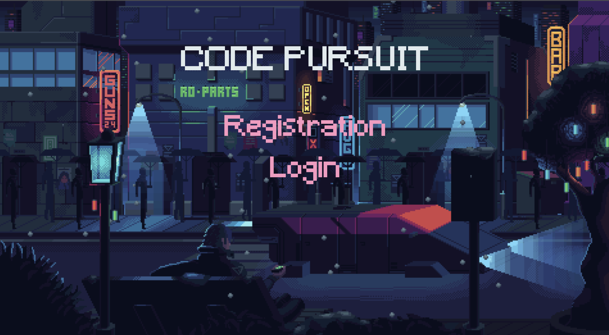
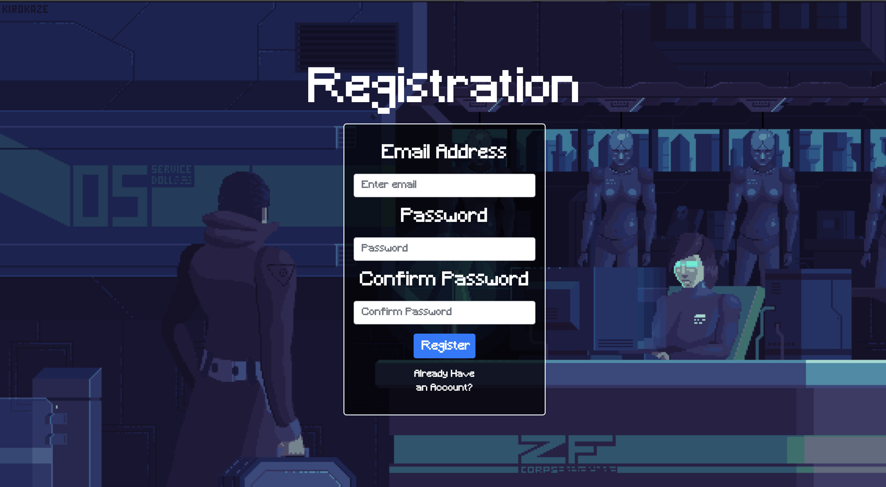
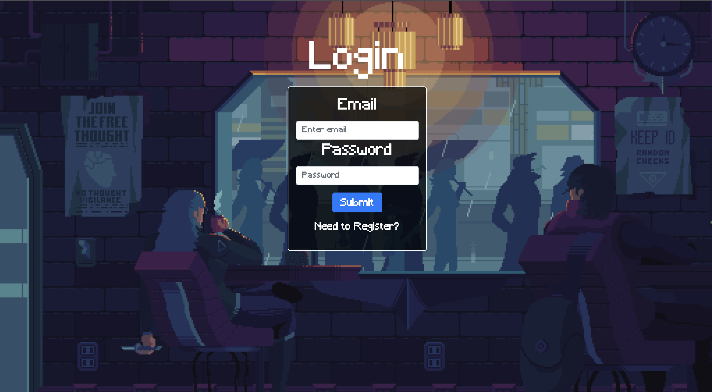
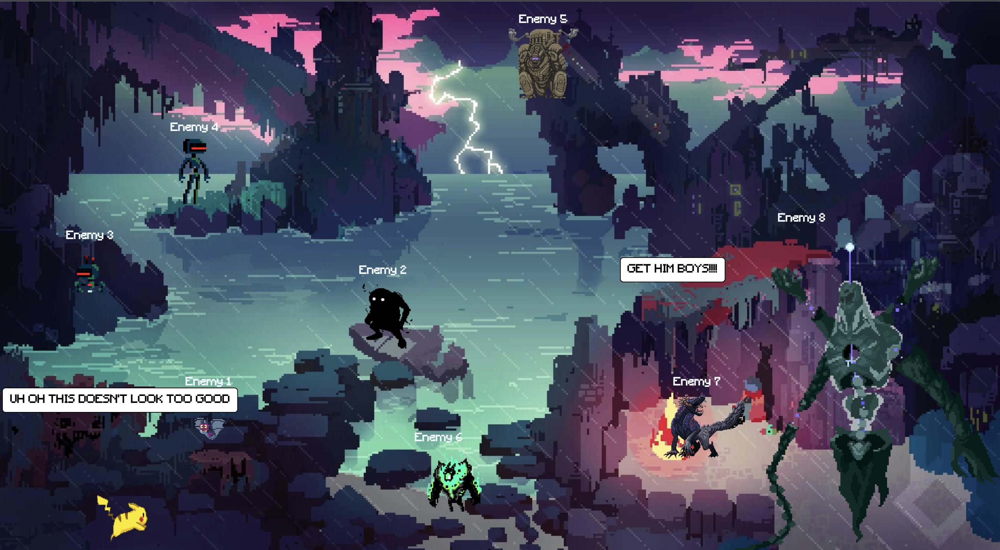
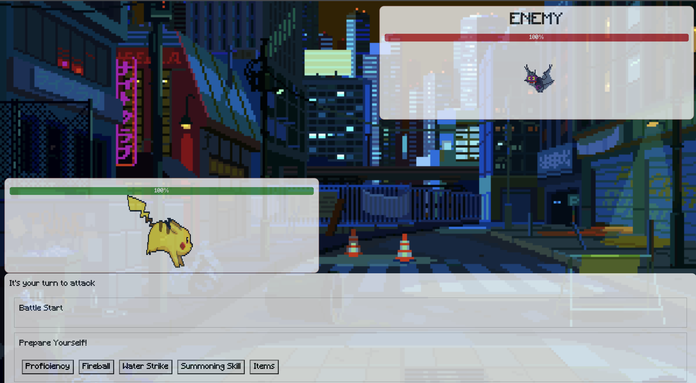
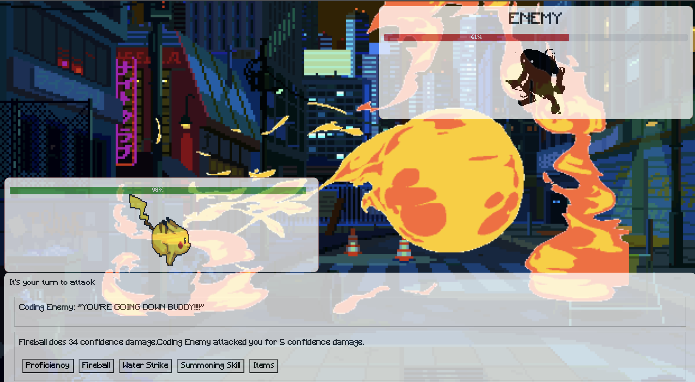
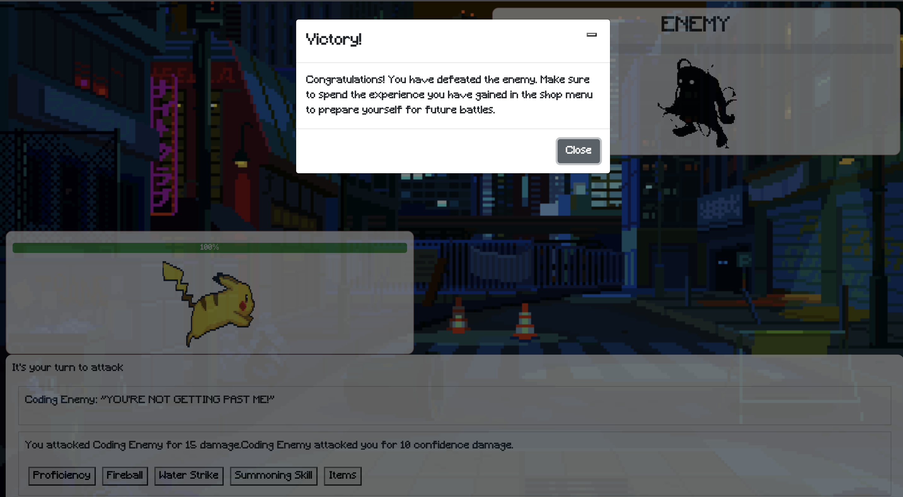
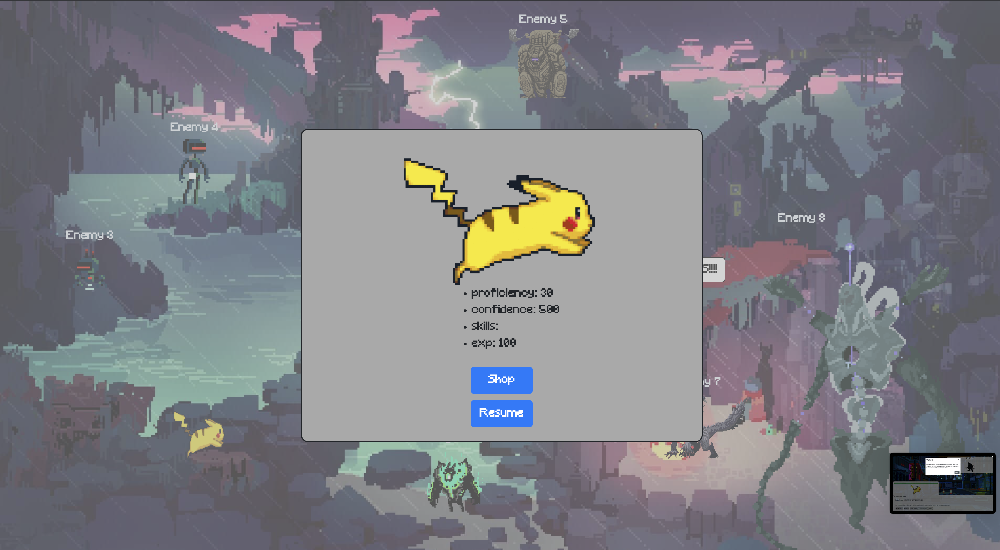
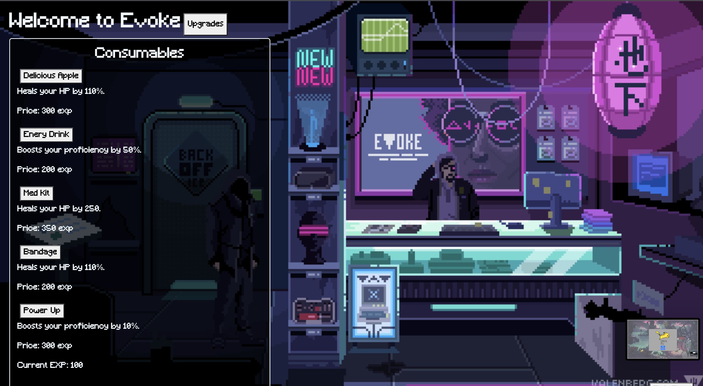
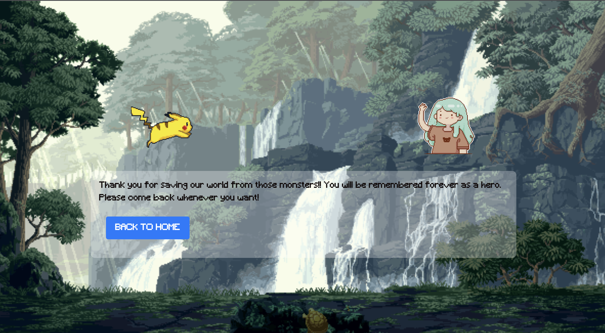

# Code Pursuit
Welcome to Code Pursuit, a strategy action turn based game. This game follows a simple narrative and allows for a light hearted casual adventure. This README will provide an overview of the project, and the different systems and features that you can use in the game.
1.Project Description
________________________________________________________________
Code Pursuit is a react based web application game that emphasizes strategy gameplay. It features a turn based battle system that allows the user to choose an attack and also features various skills and items that they can choose from.

We started with creating a frontend and backend(server) folder. 

Users will start at the homepage where there will be links for the login and registration.

The registration has a usernname, password, and a section where the user will reenter his/her password. The registration has edge casing such as the passwords must match, the email must be an email format, and the user cannot create a blank user.

The login is linked to the registration. The user must have a email already created by registering in the site. Once the information is filled and is correct, the user will be sent to a character creation/selection screen.

Once a character is selected the user will be taken to an introduction to the game.

Users will be taken to the playarea and the enemies will be shown. There are multiple enemies that are locked until you beat the the enemy before. There will be a boss at the end so we hope you get stronger!

There is a health bar, different skills with different animations, and your character you've selected will be shown along with the enemy. 

Here is the skill fireball that is being shown.

There is a win condition in our game and the user will be awarded with experience points. 

Users will be able to see their character in the pause menu by pressing escape. The user will see the stats of the current character.

In the pause menu, there will be a shop button. The shop will have two components. There is a consumables and an upgrades tab. The consumables will be a one time use and the upgrades are permanent stat boosts but increasing in price as the upgrades is bought.

Congratulations! The user has successfully beaten the game and can restart the game for their new adventure. 

Developers:
Dujuanye Henry
Hien Nguyen
John Nguyen

Technologies Used:

-Sequelize
-React Bootstrap
-React Vite
-React Router Dom

Check out our demo here!:
https://www.youtube.com/watch?v=stuNQbVeLvU